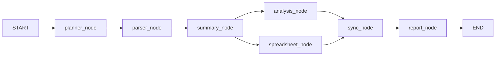

# 🏗️ 多智能体文件分析系统 - 学习文档

> 本文档详细解释整个项目的架构设计、模块实现、技术选型及扩展方法。

---

## 目录

1. [项目概述](#1-项目概述)
2. [系统架构](#2-系统架构)
3. [技术选型与工具对比](#3-技术选型与工具对比)
4. [模块详解](#4-模块详解)
   - [4.1 配置层 (config.py)](#41-配置层-configpy)
   - [4.2 数据模型 (models/)](#42-数据模型-models)
   - [4.3 工具系统 (tools/)](#43-工具系统-tools)
   - [4.4 智能体系统 (agents/)](#44-智能体系统-agents)
   - [4.5 编排层 (orchestrator/)](#45-编排层-orchestrator)
   - [4.6 API 层 (routes/)](#46-api-层-routes)
   - [4.7 应用入口 (main.py)](#47-应用入口-mainpy)
5. [数据流全解析](#5-数据流全解析)
6. [如何扩展](#6-如何扩展)
7. [常见问题](#7-常见问题)

---

## 1. 项目概述

### 1.1 这是什么？

这是一个 **多智能体文件分析系统**，可以自动完成以下流程：

```
用户上传文件 → 多 Agent 协作分析 → 输出 Markdown 报告 + Excel 数据
```

> **类比"造车工厂"**：
> - `Planner Agent` = 生产经理：看需求，排计划
> - `Parser Agent` = 拆解工：把文件"拆开"读取
> - `Summary Agent` = 质检员：总结要点
> - `Analysis Agent` = 数据分析师：算数字、找风险
> - `Spreadsheet Agent` = 档案员：整理成 Excel 表格

### 1.2 核心特性

| 特性 | 说明 |
|------|------|
| **多 Agent 协作** | 5 个专用 Agent 各司其职，通过 State 通信 |
| **Tool Calling** | Agent 不直接干活，通过 ToolRegistry 调用工具 |
| **LangGraph 编排** | 有向无环图控制流程，支持串行/并行 |
| **文件类型丰富** | 支持 PDF/DOCX/CSV/JSON/图片OCR 等 19 种格式 |
| **LLM 驱动 + 降级** | 有 API Key 用 AI 分析，没有则规则降级 |
| **可扩展架构** | 新增 Agent/Tool/文件类型不改核心代码 |

---

## 2. 系统架构

### 2.1 整体架构图

```
┌─────────────────────────────────────────────────────────┐
│                     FastAPI Server                       │
│  ┌──────────────────────────────────────────────────┐   │
│  │              REST API (routes/api.py)             │   │
│  │  POST /upload → POST /analyze → GET /tasks/{id}  │   │
│  └──────────────────────┬───────────────────────────┘   │
│                         │                                │
│  ┌──────────────────────▼───────────────────────────┐   │
│  │           LangGraph Workflow (orchestrator/)       │   │
│  │                                                    │   │
│  │  START → Planner → Parser → Summary ──→ Sync → Report → END │
│  │                                    ↕                │   │
│  │                         Analysis ←───┘              │   │
│  │                         Spreadsheet ←──┘            │   │
│  └──────────────────────┬───────────────────────────┘   │
│                         │                                │
│  ┌──────────────────────▼───────────────────────────┐   │
│  │              Agent System (agents/)                │   │
│  │  ┌────────┐ ┌────────┐ ┌────────┐ ┌────────┐    │   │
│  │  │Planner │ │ Parser │ │Summary │ │Analysis│    │   │
│  │  └───┬────┘ └───┬────┘ └───┬────┘ └───┬────┘    │   │
│  │      │          │          │          │           │   │
│  │  ┌───▼──────────▼──────────▼──────────▼────┐     │   │
│  │  │          ToolRegistry (tools/)           │     │   │
│  │  │  12 个工具：read_pdf, generate_xlsx...   │     │   │
│  │  └─────────────────────────────────────────┘     │   │
│  └──────────────────────────────────────────────┘   │
└─────────────────────────────────────────────────────────┘
```

### 2.2 设计模式：Planner + Skills + Tools

这是本项目最核心的设计模式，源自 AI Agent 领域的经典架构：

```
┌──────────┐     ┌──────────┐     ┌──────────┐
│ Planner  │ ──▶ │  Skills  │ ──▶ │  Tools   │
│ (规划者)  │     │ (技能集)  │     │ (工具箱)  │
└──────────┘     └──────────┘     └──────────┘
```

- **Planner**：分析用户需求，决定"做什么"、"谁来做"、"什么顺序"
- **Skills (Agents)**：每个 Agent 是一个技能单元，知道自己擅长什么
- **Tools**：最小的可执行单元，每个工具只做一件事

**为什么这么设计？**

| 传统方式 | 本系统方式 |
|----------|-----------|
| 一个巨大的函数处理所有逻辑 | 拆分为多个小模块，各司其职 |
| 修改一个功能可能影响全局 | 新增 Agent/Tool 不影响已有的 |
| 难以测试 | 每个 Tool/Agent 可独立测试 |
| 难以扩展 | 插拔式设计，即插即用 |

---

## 3. 技术选型与工具对比

### 3.1 为什么选这些技术？

| 技术 | 选择理由 | 替代方案 | 为什么没选替代方案 |
|------|---------|---------|-----------------|
| **LangGraph** | 专为 Agent 编排设计，支持 StateGraph、条件路由、并行分支 | LangChain, AutoGen, CrewAI | LangChain 偏 RAG，AutoGen 偏多人对话，CrewAI 不如 LangGraph 灵活 |
| **FastAPI** | 异步原生、自动 API 文档、Pydantic 校验 | Flask, Django | Flask 同步且无自动文档，Django 太重 |
| **pymupdf** | 解析 PDF 速度最快、依赖少 | PyPDF2, pdfplumber | PyPDF2 功能弱，pdfplumber 速度慢 |
| **python-docx** | Word 解析的事实标准库 | 无替代 | 唯一成熟的 python Word 库 |
| **openpyxl** | Excel 读写最成熟的 Python 库 | xlsxwriter | xlsxwriter 只能写不能读 |
| **pytesseract** | OCR 的事实标准 | easyocr, paddleocr | Google 维护，社区成熟；easyocr 速度慢，paddleocr 依赖重 |
| **Anthropic SDK** | Agent 调用 LLM 进行智能分析 | OpenAI, 本地模型 | Claude 的 Tool Use 能力最强 |
| **Uvicorn** | FastAPI 标配 ASGI 服务器 | Gunicorn | Gunicorn 不支持 ASGI |

### 3.2 为什么不选某些方案？

| 曾被考虑但放弃的方案 | 原因 |
|---------------------|------|
| **AutoGen (微软)** | 专为多 Agent 对话设计，不适合我们这种固定流程的编排 |
| **CrewAI** | 高层封装太多，控制力不够 |
| **直接拼 Prompt** | 违反"不要单 Agent 巨型 Prompt"的核心要求 |
| **Celery** | 对这个小项目太重，异步 asyncio 足够 |
| **SQLite 持久化** | MemorySaver 足够开发阶段使用 |

---

## 4. 模块详解

### 4.1 配置层 (config.py)

**路径**: `app/config.py`

**功能**: 所有全局配置的集中管理。

**核心配置项**:

```python
# 路径配置 - 决定文件存哪里
ROOT_DIR       = 项目根目录
UPLOAD_DIR     = uploads/     # 用户上传文件
OUTPUT_DIR     = output/      # 生成报告和Excel

# API 配置 - 驱动 AI 分析
ANTHROPIC_API_KEY  # 从环境变量读取，不硬编码
ANTHROPIC_MODEL    # 使用的 Claude 模型

# 文件类型映射 - 扩展名 → 内部类型
SUPPORTED_EXTENSIONS  # 定义支持哪些文件
```

**为什么从环境变量读取 API Key**？
- 安全性：不会把 Key 提交到 Git
- 灵活性：不同环境可以用不同 Key

**为什么定义文件类型映射**？
- 解耦：文件扩展名和内部处理逻辑分离
- 易扩展：新增格式只需加一行映射

### 4.2 数据模型 (models/)

**路径**: `app/models/`

#### state.py - LangGraph 状态定义

这是整个工作流的核心数据结构。所有 Node 通过这个 State 通信。

```python
# Input - 工作流入参
session_id: str              # 唯一标识一次分析任务
files: list[FileInfo]        # 要分析的文件列表
user_request: str            # 用户的自然语言需求

# Planner 输出
plan: WorkflowPlan            # 任务计划
current_task_index: int       # 当前执行到第几个任务

# 处理结果 - 逐步累积
parsed_contents: dict         # {文件名: ParsedContent} 解析结果
summary: str                  # 总结内容
analysis_result: dict         # 分析结果
xlsx_path: str                # 生成的 Excel 路径
report_path: str              # 生成的报告路径

# 控制字段
errors: list[str]             # 错误收集（可累积）
agent_history: list[str]      # 执行历史
status: str                   # 当前状态
```

**关键设计**: `Annotated[list[str], operator.add]`
- 意思是：多个 Node 可以同时向这个字段"追加"数据
- 用于 `errors` 和 `agent_history`，因为并行 Node 可能同时写
- 普通 `str` 字段一次只能一个 Node 写

#### schemas.py - API 请求/响应模型

给 FastAPI 自动生成 API 文档用的。

**Why Pydantic 而非 Python 原生 TypedDict？**
- FastAPI 原生支持 Pydantic，自动校验和文档生成
- TypedDict 是运行时透明的，Pydantic 有运行时校验

### 4.3 工具系统 (tools/)

**路径**: `app/tools/`

这是整个系统的"手和脚"——所有实际工作都是工具完成的。

#### 4.3.1 设计模式：Registry（注册中心）

```
                   ┌─────────────────────┐
                   │     ToolRegistry     │
                   │                     │
                   │  register(name, fn) │◀── 工具开发者注册
                   │  get_tool(name)     │──▶ Agent 按名获取
                   │  call_tool(name)    │──▶ 统一调用入口
                   │  list_tools()       │──▶ API 查询
                   └─────────────────────┘
```

**为什么用 Registry 而不是直接 import？**

| 直接 import 函数 | Registry 方式 |
|----------------|--------------|
| Agent 需要知道具体函数名和位置 | Agent 只需知道工具名 |
| 新增工具要改 Agent 的 import | 注册即可，Agent 自动发现 |
| 无法统一管理、鉴权、监控 | 统一入口，可以加日志、限流 |

**注册中心的优缺点**：

| 优点 | 缺点 |
|------|------|
| 解耦彻底，工具和 Agent 完全分离 | 多了一层抽象，理解成本略高 |
| 统一调用接口，可以统一处理错误 | 类型提示不如直接调用清晰 |
| 动态发现，新增工具无须改代码 | 小项目可能过度设计 |

#### 4.3.2 各工具详解

##### file_reader.py - 文件读取工具

**解决的问题**：不同文件格式有不同的解析库和方式，需要统一接口。

**统一接口**：
```python
def read_xxx(file_path: str) -> dict:
    # 返回格式：
    return {
        "text": "提取的文本内容",
        "tables": [["表头1", "表头2"], ["数据1", "数据2"]],
        "metadata": {"pages": 5, "author": "张三"},
    }
```

**为什么统一返回格式？**
- 后续 Agent 不需要关心文件格式，统一处理 text + tables
- 新增文件类型只要适配这个接口

**各格式实现**：

| 格式 | 使用的库 | 关键点 |
|------|---------|--------|
| PDF | **pymupdf** (fitz) | 比 PyPDF2 快 10 倍，直接提取文本 |
| DOCX | **python-docx** | 同时提取段落文本和 Word 表格 |
| TXT | **chardet** 检测编码 | 自动检测 GBK/UTF-8，避免乱码 |
| JSON | 内置 json 模块 | 解析后重新格式化，增加可读性 |
| CSV | csv 模块 + chardet | 同时返回原始文本和结构化表格 |

**为什么 PDF 用 pymupdf 而非 PyPDF2？**

```
pymupdf:   10页 PDF → ~0.3秒 解析
PyPDF2:    10页 PDF → ~3秒 解析
pdfplumber:10页 PDF → ~2秒 解析（更精确，但慢）
```

##### csv_processor.py - CSV 处理

**两个工具**：

1. `read_csv`：解析 CSV 为文本 + 表格格式
2. `analyze_csv`：对 CSV 数据做基本统计分析

**为什么 CSV 要有专门的 processor？**
- CSV 本质是表格数据，提取表格结构比纯文本更有价值
- 可以为后续的 Analysis Agent 提供结构化数据

##### xlsx_generator.py - Excel 生成

**使用的库**: openpyxl

**功能**：
- 接收 `[{headers: [...], rows: [[...], ...]}]` 格式数据
- 生成带格式的 .xlsx 文件（表头蓝色背景、斑马纹行、自动列宽）
- 自动尝试将字符串转为数字（"1,234" → 1234）

**为什么用 openpyxl 而非 xlsxwriter？**

| 对比项 | openpyxl | xlsxwriter |
|--------|----------|------------|
| 读功能 | ✅ 可读可写 | ❌ 只能写 |
| 写速度 | 中等 | 快 |
| 样式支持 | 丰富 | 丰富 |
| 大文件 | 内存占用高 | 流式写入，内存低 |

目前只用到写功能，理论上 xlsxwriter 更合适。选择 openpyxl 是为了保留未来读取 Excel 的可能性。

##### md_writer.py - Markdown 写入

**最简单的工具**——就是写入 UTF-8 文本文件。

**为什么单独做一个工具？**
- 保持一致性：所有"输出操作"都通过 ToolRegistry
- 便于后续扩展：比如未来可能加模板渲染、语法检查

##### ocr_tool.py - 图片文字识别

**使用的库**: pytesseract (Google 的 Tesseract OCR)

**OCR 工作原理**：
```
图片 → [Pillow 读取] → 像素矩阵 → [Tesseract 识别] → 文本
```

**为什么不选另外的 OCR 方案？**

| OCR 方案 | 优点 | 缺点 |
|---------|------|------|
| **pytesseract** | 成熟、稳定、中英文支持好 | 需要安装系统级 Tesseract 引擎 |
| **EasyOCR** | 深度学习，准确率高 | 加载模型慢（~10秒），需要 GPU |
| **PaddleOCR** | 中文识别率最高 | 依赖重，安装复杂 |
| **Tesseract 4.x** | 轻量、离线可用 | 对复杂排版效果一般 |

##### data_analyzer.py - 数据分析工具

**三个分析工具**：

1. **analyze_statistics**：基本统计
   - 自动识别所有数值列
   - 计算：计数、最小值、最大值、总和、均值、中位数、标准差
   - 使用 Python 标准库 `statistics`

2. **risk_analysis**：风险分析
   - 识别数据中的异常值
   - 可自定义阈值

3. **trend_analysis**：趋势分析
   - 针对时间序列数据
   - 计算变化幅度、变化百分比
   - 判断趋势方向（上升/下降/平稳）

**为什么用 Python 原生而非 pandas？**
- 这些分析功能用标准库就可以实现
- pandas 依赖重（~10MB），对简单统计是过度杀伤

**什么场景下应该换 pandas？**
- 需要复杂的分组聚合（groupby）
- 处理百万级数据
- 需要时间序列重采样

---

### 4.4 智能体系统 (agents/)

**路径**: `app/agents/`

**核心哲学**: Agent 不做具体工作，Agent 调用工具，工具干活。

#### 4.4.1 BaseAgent（抽象基类）

```python
class BaseAgent(ABC):
    name: str           # Agent 名称
    description: str    # 描述（给 Planner 看）
    tools: list[str]    # 能使用的工具列表

    @abstractmethod
    async def execute(self, state, context) -> dict
```

**为什么用抽象基类？**
- 定义统一接口，所有 Agent 行为一致
- 新增 Agent 只需继承 + 实现 execute
- 类型系统可以检查是否实现了必要方法

**为什么 Agent 不直接 import 工具？**
- 保持解耦：Agent 只知道工具名，不知道具体实现
- 便于测试：可以 mock registry 来测试 Agent

#### 4.4.2 Planner Agent

**职责**: 分析用户需求 → 生成任务计划

**两种模式**：

| 模式 | 触发条件 | 行为 |
|------|---------|------|
| **LLM 模式** | 配置了 ANTHROPIC_API_KEY | 调用 Claude 分析文件类型和需求，生成结构化计划 |
| **降级模式** | 无 API Key | 规则生成：先全部解析 → 总结 → 分析 → 生成表格 |

**LLM 模式的工作原理**：
```
用户请求 + 文件列表
        │
        ▼
[构造 Prompt] ──▶ [System Prompt 描述 Agent/工具] ──▶ [Claude API]
                                                          │
                                                          ▼
[解析 JSON] ◀── [结构化响应] ◀── [Claude 返回任务计划]
```

**为什么 Planner 的职责如此关键？**
- 在真正多 Agent 系统中，Planner 是"大脑"
- 它决定：做什么（what）、谁做（who）、顺序（when）
- 当前实现是"软编码"——LLM + 规则降级，未来可以完全由 LLM 驱动

#### 4.4.3 Parser Agent

**职责**: 解析所有文件内容

**流程**：
```
文件列表
  │
  ├── CSV 文件 → registry.call_tool("read_csv", ...)
  ├── 图片文件 → registry.call_tool("ocr_image", ...)
  └── 其他文件 → get_file_reader(file_type)(file_path)
                      │
                      ▼
              ParsedContent(text, tables, metadata)
```

**为什么 CSV 和图片要特殊处理？**
- CSV 的 `read_csv` 会解析结构化表格，`read_txt` 只是读文本
- OCR 需要先用 Pillow 打开图片，再用 Tesseract 识别

#### 4.4.4 Summary Agent

**职责**: 将所有解析结果汇总成 Markdown 摘要

**两种模式**：

| 模式 | 产物 |
|------|------|
| **LLM 模式** | Claude 生成的段落式总结，包含文件概览、要点、发现 |
| **降级模式** | 规则生成的统计摘要：字符数、表格数 |

**为什么用 write_markdown 工具而不是直接写文件？**
- 一致性：所有输出操作走工具
- 可替换：未来可以换成写 PDF 或 HTML，Agent 代码不用改

#### 4.4.5 Analysis Agent

**职责**: 对数据进行统计分析、风险分析、趋势分析

**流程**：
```
ParsedContents
      │
      ▼
[_extract_tabular_data] ──▶ data: [{"列1": "值1", ...}, ...]
      │
      ├── call_tool("analyze_statistics", data) → 基本统计
      ├── call_tool("risk_analysis", data) → 风险分析
      │
      └── [LLM 综合分析] (如有 API Key)
              │
              ▼
      {"summary": "...", "key_insights": [...], "risks": [...], "recommendations": [...]}
```

**LLM 分析能做什么规则做不到的事？**
- 理解文本语境（比如"虽然数字上升，但原因是季节性波动"）
- 跨文件的关联分析
- 用自然语言给出可操作的商业建议

#### 4.4.6 Spreadsheet Agent

**职责**: 提取结构化数据并生成 XLSX

**表格来源**：
1. **原生表格**：来自 CSV/DOCX 解析出的结构
2. **管道符表格**：从 Markdown/文本中提取 `| A | B | C |` 格式的行

**为什么要有管道符表格提取？**
- 很多文本文件中的表格是用 `|` 分隔的
- 无需额外解析，正则即可提取

---

### 4.5 编排层 (orchestrator/)

**路径**: `app/orchestrator/`

#### 4.5.1 LangGraph 工作流

**什么是 StateGraph？**
- 有向无环图（DAG）的每个节点是一个函数
- 每个函数接收当前 State，返回 State 的局部更新
- 边的定义决定了执行顺序

**为什么选 StateGraph 而非 Sequential？**
- 支持并行分支（Summary → Analysis + Spreadsheet）
- 未来可以加条件判断、循环
- 可视化程度高，容易理解

#### 4.5.2 Node 详解

**7 个 Node**：



| Node | 作用 | 输入 | 输出 |
|------|------|------|------|
| **planner_node** | 分析需求，规划任务 | files, user_request | plan |
| **parser_node** | 解析所有文件 | files | parsed_contents |
| **summary_node** | 总结内容 | parsed_contents | summary, report_path |
| **analysis_node** | 数据分析 | parsed_contents | analysis_result |
| **spreadsheet_node** | 生成 Excel | parsed_contents | xlsx_path |
| **sync_node** | 同步点 | - | status |
| **report_node** | 生成最终报告 | 所有累积结果 | report_path, status |

#### 4.5.3 并行分支与同步

**关键设计**: `Send` + `sync_node`

```python
def route_after_summary(state):
    return [
        Send("analysis_node", state_copy),
        Send("spreadsheet_node", state_copy),
    ]
```

**为什么需要 sync_node？**
- 并行任务（analysis + spreadsheet）完成后需要合并
- sync_node 是一个"栅栏"（barrier），等待两个都完成
- 然后才进入 report_node

#### 4.5.4 MemorySaver

LangGraph 的检查点机制。目前用 MemorySaver（内存中），生产环境可以换：
- **MemorySaver**（开发用）：速度快，重启丢失
- **SqliteSaver**（单机生产）：持久化，可恢复
- **PostgresSaver**（分布式生产）：生产标准，支持并发

---

### 4.6 API 层 (routes/)

**路径**: `app/routes/api.py`

#### 4.6.1 接口设计

| 接口 | 方法 | 用途 | 为什么这样设计 |
|------|------|------|--------------|
| `/agents` | GET | 查询系统有哪些 Agent | 前端动态渲染 |
| `/tools` | GET | 查询系统有哪些工具 | 开发者调试 |
| `/upload` | POST | 上传文件 | 文件与分析分离，更灵活 |
| `/analyze` | POST | 启动分析 | 异步返回 task_id |
| `/tasks` | GET | 列出所有任务 | 管理界面 |
| `/tasks/{id}/status` | GET | 轮询任务状态 | 异步任务的标准模式 |
| `/tasks/{id}/result` | GET | 获取结果 | 分离状态查询和结果获取 |
| `/output/{file}` | GET | 下载文件 | 独立的文件下载 |

**为什么 upload 和 analyze 分开？**
- 复用：同一批文件可以用不同的需求重新分析
- 解耦：上传可能失败，不应与分析耦合
- 体验：上传进度和分析进度独立跟踪

#### 4.6.2 异步任务模式

```
POST /analyze → 202 Accepted → {task_id: "abc123"}
                                  │
                                  ▼
GET /tasks/abc123/status → {status: "running", agent: "parser"}
                                  │
                                  ▼
GET /tasks/abc123/status → {status: "completed"}
                                  │
                                  ▼
GET /tasks/abc123/result → {summary: "...", xlsx_path: "..."}
```

**为什么用异步而非同步？**
- 分析可能需要 30 秒以上
- HTTP 请求不应该阻塞这么久
- 用户可以实时看到进度

**为什么用 asyncio.create_task 而非 Celery？**
- 项目当前规模小，不需要消息队列
- asyncio.create_task 零依赖
- 服务重启后任务丢失——这是当前已知的限制

---

### 4.7 应用入口 (main.py)

**路径**: `app/main.py`

标准 FastAPI 启动流程：
1. 创建 FastAPI 实例
2. 添加 CORS 中间件（允许前端跨域请求）
3. 注册路由
4. 定义根路径和健康检查端点
5. main() 函数启动 uvicorn 服务器

**CORS 为什么允许所有来源 (`allow_origins=["*"]`)？**
- 开发阶段方便前端调试
- 生产环境应限制为具体域名

---

## 5. 数据流全解析

### 5.1 一次完整请求的生命周期

```
用户
  │
  │ 1. POST /upload (上传 sales.csv, notes.txt)
  ▼
[API] 保存文件到 uploads/ 目录
  │
  │ 2. POST /analyze (file_ids: "xxx.csv,yyy.txt")
  ▼
[API] 创建任务 → 返回 task_id
  │
  │ 3. asyncio.create_task() 启动后台工作流
  ▼
[Workflow: planner_node]
  │  - 读取文件列表和用户请求
  │  - 调用 Claude API 生成任务计划
  │  - 输出: plan = {tasks: [...], parallel_groups: [...]}
  ▼
[Workflow: parser_node]
  │  - 遍历每个文件
  │  - CSV → read_csv(file_path) → 文本 + 表格
  │  - TXT → read_txt(file_path) → 文本
  │  - 输出: parsed_contents = {"xxx.csv": ParsedContent, "yyy.txt": ParsedContent}
  ▼
[Workflow: summary_node]
  │  - 传入 parsed_contents
  │  - 调用 Claude API 生成 Markdown 摘要
  │  - 或规则生成统计摘要
  │  - 输出: summary = "## 文件概览..."
  ▼
[并行分支]:
  │
  ├── [analysis_node]:
  │   - 提取表格数据
  │   - 调用 analyze_statistics → 统计
  │   - 调用 risk_analysis → 风险
  │   - 调用 Claude API → LLM 分析
  │   - 输出: analysis_result = {statistics: {...}, risk: {...}}
  │
  └── [spreadsheet_node]:
      - 从 parsed_contents 提取表格
      - 调用 generate_xlsx(tables) → .xlsx 文件
      - 输出: xlsx_path = "output/data_2024.xlsx"
  │
[同步点: sync_node] ← 等待两个并行任务完成
  │
  ▼
[Workflow: report_node]
  │  - 汇总 summary + analysis_result + xlsx_path
  │  - 拼接 Markdown 模板
  │  - 调用 write_markdown → 保存 final_report.md
  │  - 输出: report_path, status = "completed"
  ▼
[API] 用户轮询 GET /tasks/{id}/status → "completed"
  │
  │ 用户 GET /tasks/{id}/result → 获取分析结果
  │
  │ 用户 GET /output/final_report.md → 下载报告
  │ 用户 GET /output/extracted_data.xlsx → 下载数据
  ▼
用户收到 Markdown 报告 + Excel 数据表
```

---

## 6. 如何扩展

### 6.1 新增文件类型

**例子: 支持 .pptx (PowerPoint)**

步骤：

```python
# 1. 在 config.py 添加映射
SUPPORTED_EXTENSIONS = {
    ".pptx": "powerpoint",   # 加这行
}

# 2. 在 tools/file_reader.py 添加解析函数
def read_pptx(file_path: str) -> dict:
    from pptx import Presentation
    prs = Presentation(file_path)
    text_parts = []
    for slide in prs.slides:
        for shape in slide.shapes:
            if hasattr(shape, "text"):
                text_parts.append(shape.text)
    return {"text": "\n".join(text_parts), "tables": [], "metadata": {}}

# 3. 添加到 readers 映射
def get_file_reader(file_type: str):
    readers = {
        ...
        "powerpoint": read_pptx,  # 加这行
    }

# 4. 注册工具
registry.register(read_pptx, "read_pptx", "解析 PPT 文件", {"file_path": "路径"}, agent="parser")

# 5. 在 Planner 的 _tool_for_type 中添加映射
"powerpoint": "read_pptx"
```

**已完成**: 5 步，不改 Agent 核心代码。

### 6.2 新增 Agent

**例子: 新增 "翻译 Agent"**

```python
# 1. 创建 agents/translator_agent.py
class TranslatorAgent(BaseAgent):
    name = "translator"
    description = "将文件内容翻译成英文"
    tools = ["write_markdown"]

    async def execute(self, state, context=None) -> dict:
        from anthropic import Anthropic
        client = Anthropic(api_key=ANTHROPIC_API_KEY)
        # ... 调用翻译 API
        return {"translation": translated_text}

# 2. 在 agents/__init__.py 注册
from .translator_agent import TranslatorAgent

# 3. 在 planner.py 的 SYSTEM_PROMPT 添加描述
# - translator: 翻译 - 将文件内容翻译成英文

# 4. 在 orchestrator/nodes.py 添加节点函数
async def translator_node(state) -> dict:
    agent = TranslatorAgent()
    return await agent.execute(state)

# 5. 在 orchestrator/workflow.py 注册节点和边
builder.add_node("translator_node", translator_node)
builder.add_edge("parser_node", "translator_node")  # 解析后翻译
```

### 6.3 新增 Tool

```python
# 1. 创建工具函数
def html_to_pdf(html_content: str, output_path: str = "") -> str:
    """HTML 转 PDF"""
    # ... 实现

# 2. 注册
from app.tools.registry import registry
registry.register(
    html_to_pdf, "html_to_pdf",
    "将 HTML 内容转换为 PDF 文件",
    {"html_content": "HTML 内容", "output_path": "输出路径"},
    agent="reporter",  # 属于 reporter Agent
)
```

---

## 7. 常见问题

### Q: 为什么 Agent 不互相直接调用？

**A**: 这是有意设计。Agent 通过 Workflow State 通信，不是直接调用。原因：
1. **解耦**：一个 Agent 挂了不影响其他 Agent
2. **可观测性**：State 记录了所有变化，容易调试
3. **可恢复**：未来可以实现断点续跑

### Q: 为什么要用 LangGraph 而非自己写 if-else？

**A**: LangGraph 提供了：
1. **并行执行**：Python 原生实现并行需要 ThreadPool 或 asyncio.gather，LangGraph 的 Send 更简洁
2. **条件路由**：决策逻辑和业务逻辑分离
3. **检查点**：MemorySaver 自动保存状态
4. **可视化**：可以用 `graph.get_graph().draw_mermaid()` 画出流程图

### Q: 什么时候该用 LLM，什么时候用规则？

| 场景 | 用 LLM | 用规则 |
|------|--------|--------|
| 理解自然语言 | ✅ 解释用户意图 | ❌ |
| 生成总结 | ✅ 段落式分析 | ❌ |
| 提取数据 | ❌ 可能胡编 | ✅ 精确 |
| 计算统计 | ❌ 数学不好 | ✅ 精确 |
| 风险判断 | ✅ 综合上下文 | ✅ 基于公式 |
| 文件解析 | ❌ 慢且不准 | ✅ 快速准确 |

### Q: 这个系统可以上生产环境吗？

**目前限制**：
1. 任务状态存储在内存，服务重启丢失
2. 没有用户认证
3. 文件没有过期清理

**需要做的改进**：
1. 换用 SqliteSaver/PostgresSaver 持久化 State
2. 添加 JWT 认证
3. 加定时任务清理过期文件
4. 添加任务队列（可选，如果并发要求高）

---

> 本文档会随代码更新。如有不一致，以代码为准。
